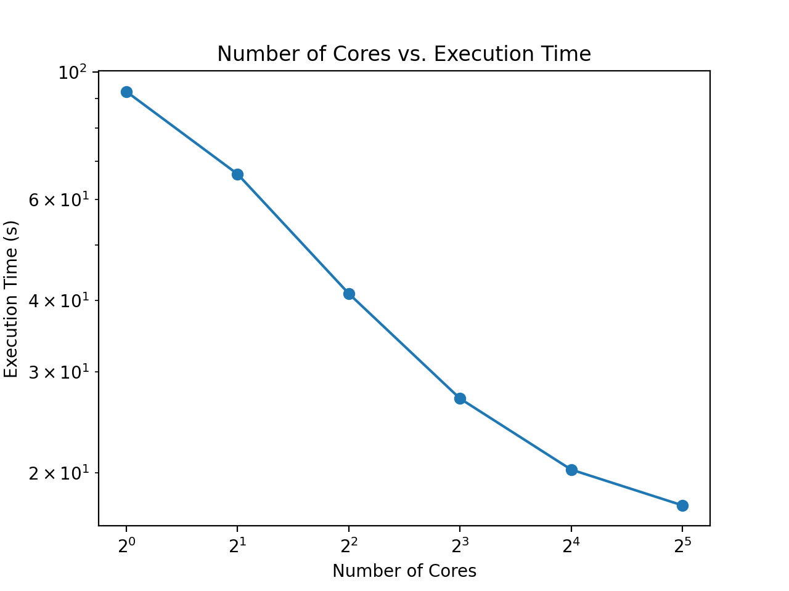

MapReduce for the "Word Frequency" example found [here](mr2004.pdf) using sklearn's [20 newsgroups dataset](https://scikit-learn.org/stable/datasets/real_world.html#the-20-newsgroups-text-dataset).

### Setup
```console
conda env create -f environment.yml
conda activate mapReduce
```
### Use
```console
python mapReduce.py <number_of_cores>
```
### Results

